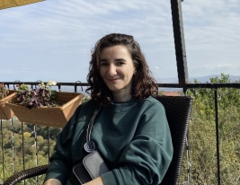

# Nara Safarian CV

##### Location
Tbilisi, Georgia
##### Phone number
+995 on demand
##### Bio
I've graduated from Herzen State University in Saint Petersburg, my major is English language and I've been working as an English teacher since then, mainly with B1 - C2 students. I've become very patient, organized and adaptable during my teaching career, improved my speaking and listening skills. As a result of my job, I know not only how to teach but also how to learn which is an essential skill today. 
All my life I've been learning different (human) languages, I can speak some French and Spanish as well and now I've decided to try other kind of languages. How different can it be, right? 

##### Skills
- Java Script
- Type Script
- HTML5
- CSS
- React

##### Code
function greet(name){
  return  'Hello, ' + name + ' how are you doing today?'
}

##### Experience
I don't have any job experience in IT, but i've been studying JS for some time already and have some finished projects you can find below:
1. [Kekstagram](https://github.com/Nara-Safarian/1763681-kekstagram-24)
2. [What to watch](https://github.com/Nara-Safarian/1763681-what-to-watch-10)
3. [Cinemaddict](https://github.com/Nara-Safarian/1763681-cinemaddict-16)

##### Education
- HTML Academy course - Профессия «JavaScript-разработчик»
- JT Cloud QA Boot Camp

##### English 
C1-C2